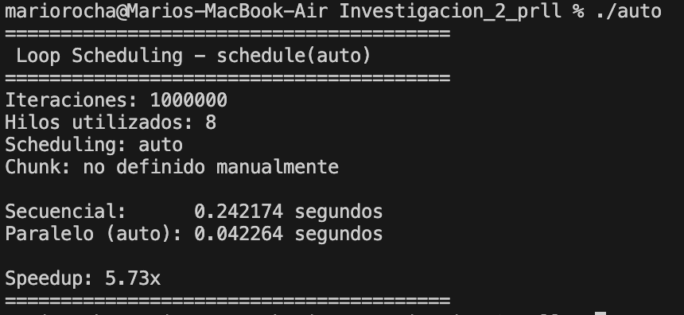
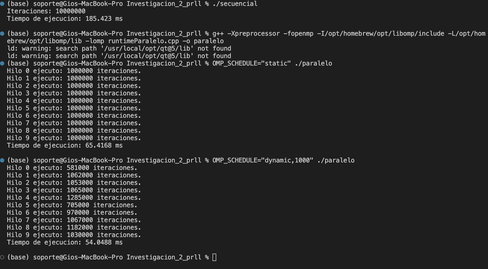

## Investigación #2

### Auto 

En la versión secuencial las iteraciones que necesitamos se ejecutan una después de otra. Lo que hacemos es tomar cada elemento del arreglo a, realizar la operación y luego guardar el resultado en el arreglo b.

En la versión paralela usamos schedule(auto). Con este tipo de scheduling nosotros no elegimos cómo se reparten las iteraciones entre los hilos, sino que dejamos esa decisión a la implementación de OpenMP. Lo usamos porque las iteraciones son independientes y realizan la misma cantidad de trabajo, por lo que podemos dejar que OpenMP decida el reparto sin tener que escoger manualmente una estrategia o un tamaño de chunk.

Los hilos se utilizan automáticamente al llegar al #pragma omp parallel for. La cantidad puede ser determinada por OpenMP o se puede fijar usando OMP_NUM_THREADS. En nuestra ejecución se utilizaron 8 hilos. Como usamos schedule(auto), no definimos manualmente un tamaño de chunk; esa decisión también queda a cargo de la implementación de OpenMP.

En la prueba, la versión secuencial tardó 0.242174 segundos, mientras que la versión paralela tardó 0.042264 segundos, obteniendo un speedup de 5.73x.

## Resultado de la ejecución

### Runtime

Runtime es un mecanismo de delegación de trabajo, a diferencia de los diferentes tipos de planificación de distribución de carga. Específicamente, se utiliza para evitar la recompilación durante el Fine-Tuning al permitir ejecutar benchmarks automatizados y compilar el código una sola vez. Además, tiene la ventaja de la portabilidad en donde se permite que un script de despliegue ajuste la distribución de acuerdo con los recursos físicos disponibles en el servidor destino. Por último, tiene la ventaja de flexibilidad en donde cambios en dato de entrada pueden ser manejados por la distriibución requerida.  

En este ejemplo, el tamaño del chunk depende  valor que se le asignado a la variable OMP_SCHEDULE antes de la ejecución. Para el OMP_SCHEDULE estático, se dividen 10 millones de iteraciones en partes exactamente iguales entre el número total de hilos. Mientras para el dinámico se define un chunk fijo de 10,000 iteraciones y si un hilo termina,  solicita el siguiente disponible. 

## Resultado de la ejecución

